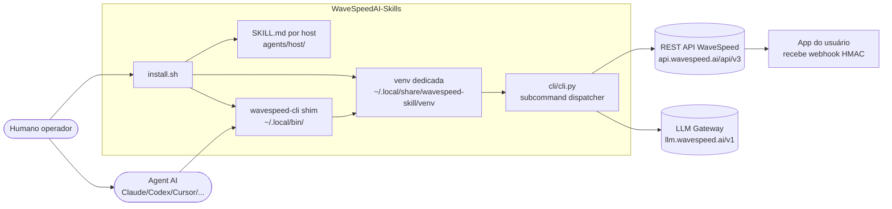
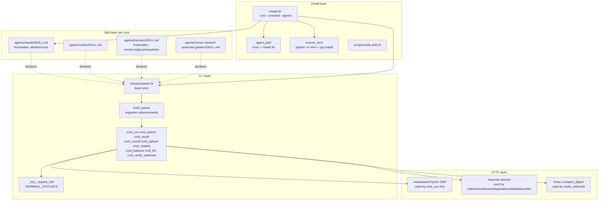

# Design — `WaveSpeedAI-Skills`

> Visão geral da arquitetura. Documento vivo. Decisões pontuais ficam em ADRs (`./ADR-*.md`).
> Audiência: devs novos no projeto, agents AI, revisores externos.

---

## 1. Contexto de sistema

Quem fala com quem. Escopo: bundle de `SKILL.md` + CLI Python + installer Bash. Não é serviço hospedado.

Notas:
- `installer` (`install.sh`) é único caminho de escrita em `~/.claude/skills/`, `~/.codex/skills/`, ..., `~/.local/bin/wavespeed-cli`, `~/.local/share/wavespeed-skill/venv`.
- `agent` AI nunca chama REST direto: passa por `wavespeed-cli` (shim) — garante isolamento, venv e auth via env.
- `cli/cli.py` é o único lugar que conhece `WAVESPEED_API_KEY`, `API_BASE`, `LLM_BASE`. Hosts e SKILL.md não veem segredo.
- Webhooks: WaveSpeed assina callbacks com HMAC-SHA256; verificação local via `wavespeed-cli verify-webhook`.

---

## 2. Componentes (zoom)

Detalhe interno do bundle:

Princípio: cada camada tem um único motivo pra mudar. Frontmatter muda → toca SkillLayer. API REST muda → toca HttpLayer. Host novo → toca SkillLayer + InstallLayer (novo `agent_path`).

---

## 3. Boundaries

| Boundary | Responsabilidade | Regra |
|---|---|---|
| Skill layer | Declarar capacidade ao host (frontmatter + body) | Não chama REST direto. Só descreve quando/como invocar `wavespeed-cli`. |
| CLI dispatch | Parsear args, rotear pra `cmd_*` | Sem lógica de domínio. Sem chamada HTTP — delega pra HTTP layer. |
| HTTP layer | Falar com `api.wavespeed.ai` e `llm.wavespeed.ai` | Lê `WAVESPEED_API_KEY` via `_key()`. SDK só em `cmd_run`; resto é `requests`. |
| Install layer | Resolver paths por host, criar venv, copiar SKILL.md | Idempotente. `--uninstall` reverte. Não toca `~/.zshrc`. |
| Webhook verify | Validar HMAC do callback recebido pelo app do usuário | `hmac.compare_digest` constant-time. Nunca `==`. |

Cruzar boundary errado = code smell. Exemplo: SKILL.md com `Bash(curl https://api.wavespeed.ai/...)` é vermelho — tem que passar pela CLI.

---

## 4. Stack

| Camada | Tecnologia |
|---|---|
| Linguagem CLI | Python 3.10+ (target `py310` em `pyproject.toml`) |
| Argparse | `argparse` stdlib (sem `click`/`typer`) |
| HTTP | `requests` (deps mínima) + `wavespeed` Python SDK opcional para `cmd_run` |
| Crypto | `hmac` + `hashlib` stdlib |
| Skill packaging | Markdown + YAML frontmatter (varia por host) |
| Installer | Bash 4+ (`install.sh`, `cli/wavespeed-cli`, `scripts/verify-skill.sh`) |
| Venv | `python -m venv` em `~/.local/share/wavespeed-skill/venv` |
| Lint/format | Ruff (`pyproject.toml: tool.ruff`, target `py310`) |
| Type check | mypy (`pyproject.toml: tool.mypy`, `python_version = "3.10"`) |
| CI | TODO: humano configurar (`.github/workflows/` ainda não existe pra Python) |
| Distribuição | `curl ... install.sh \| bash` (não há pacote PyPI) |

Mudou stack? Abrir ADR.

---

## 5. Decisões principais

ADRs em `./ADR-*.md`. Resumos esperados (criar quando decisão for tomada):

- ADR-001 — Por que CLI Python e não Node/Go: SDK oficial WaveSpeed é Python; `requests` cobre o resto sem dep extra.
- ADR-002 — Por que venv dedicada: evita `pip install` global poluir `site-packages`.
- ADR-003 — Por que frontmatter por host: cada host (Claude/Hermes/Codex) interpreta YAML diferente; não dá pra unificar sem perder informação.
- ADR-004 — Por que `argparse` em vez de `click`/`typer`: zero deps, suficiente pra surface da CLI atual.

Toda decisão que afeta mais de um componente ou trava reversibilidade vira ADR. Detalhe: `ADR-template.md`.

---

## 6. Fluxo de uma invocação típica

`Humano: "gera imagem de gato astronauta com z-image/turbo"`

1. Agent host (ex: Claude Code) lê `~/.claude/skills/wavespeed/SKILL.md`.
2. Casa trigger ("gera imagem", "z-image") com bullet do "When to use".
3. Agent monta comando: `wavespeed-cli run wavespeed-ai/z-image/turbo '{"prompt":"cat astronaut"}'`.
4. Shim `~/.local/bin/wavespeed-cli` ativa `~/.local/share/wavespeed-skill/venv` e exec `cli.py`.
5. `build_parser()` casa subcomando `run` → `cmd_run(args)`.
6. `_require_sdk()` checa `wavespeed` SDK; `_key()` lê `WAVESPEED_API_KEY`.
7. SDK submete task em `POST {API_BASE}/{model_uuid}` e faz polling até status terminal (`TERMINAL_STATUSES`).
8. Resposta JSON com `outputs[]` vai pra stdout. Exit code 0 (sucesso) ou 1 (`failed`/`error`).
9. Agent lê stdout, mostra URL da imagem ao humano.

Fluxo assíncrono (`submit` + `--webhook-url`):
1-7 igual, mas em vez de polling, WaveSpeed envia callback HMAC-SHA256 ao endpoint do usuário.
8. App do usuário valida com `wavespeed-cli verify-webhook <body> <signature>` (lê `WAVESPEED_WEBHOOK_SECRET`).

---

## 7. Não-objetivos

- Não somos SDK — `pip install wavespeed` já existe; aqui é wrapper + skills.
- Não cobrimos ComfyUI graph workflows — repo separado da WaveSpeed.
- Não fazemos geração local — tudo é inferência via API.
- Não suportamos auth multi-key — uma `WAVESPEED_API_KEY` por máquina.
- Não substituímos clientes vendor (OpenAI/Anthropic direto) — só passa pelo gateway WaveSpeed.

---

## 8. Observabilidade

CLI é stateless e síncrona. Não há tracing distribuído ou métricas RED — fora de escopo.

- `--debug`: imprime request/response HTTP no stderr (planejado, ver BACKLOG #17).
- Exit codes: `0` sucesso, `1` falha de domínio (task `failed`/`error` ou validação webhook), `2` config (`WAVESPEED_API_KEY` faltando), outros não usados.
- Logs estruturados: TODO se virar daemon. Hoje é stdout JSON cru ou stderr texto.
- PII: prompt/output passa por stdout — usuário decide o que loga. CLI não persiste nada local.

---

## 9. Como evoluir este documento

- Mudança pequena (typo, ajuste de diagrama existente): PR direto.
- Componente novo (ex: cache local de uploads): abrir ADR, depois atualizar `DESIGN.md`.
- Renomear conceito: atualizar glossário em `.specs/product/DOMAIN.md` no mesmo PR.
- Host novo (Aider, Kilo, ...): seção de boundaries não muda; só `Install layer` ganha nova entrada em `agent_path()`.
