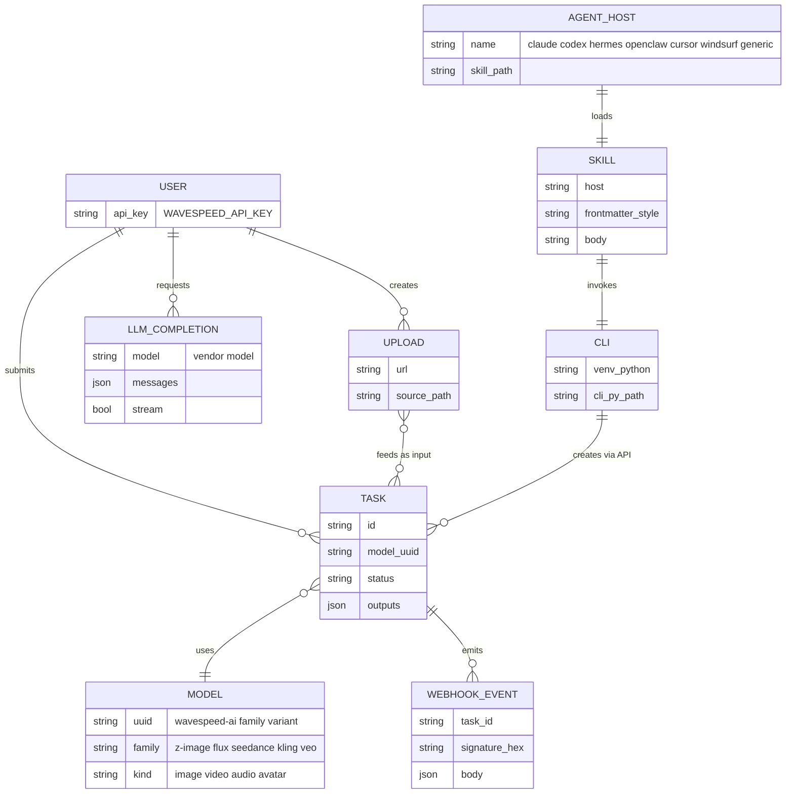
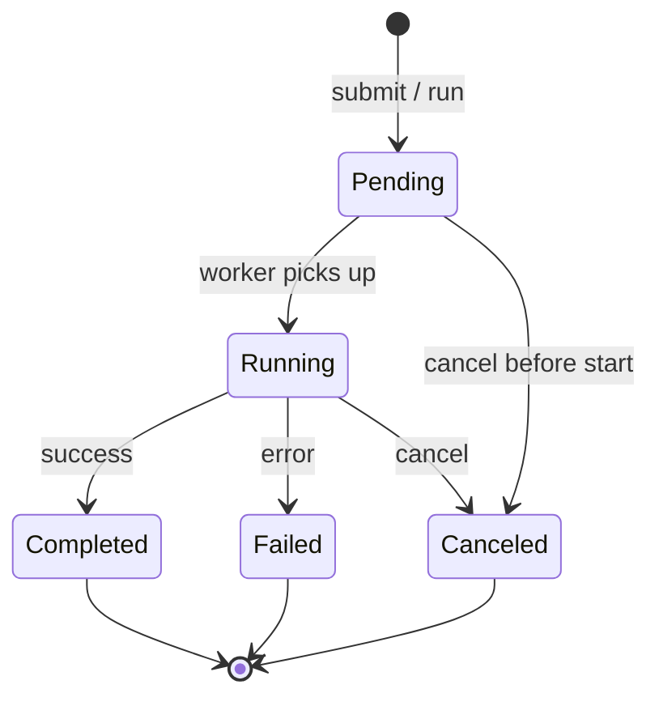

# DOMAIN — WaveSpeedAI-Skills

Glossário e modelo de entidades. Quando um termo aparece no código (variável, classe, endpoint, comando da CLI), ele deve estar aqui antes. Quando alguém pergunta "o que é X?", a resposta vem deste arquivo.

> Regra: nada de sinônimos não documentados. Se "task" e "prediction" significam a mesma coisa, escolhe um e mantém em todo o repo.

---

## Glossário

Tabela ordenada alfabeticamente. Manter conciso (1-2 linhas por termo).

| Termo | Definição | Onde aparece |
|---|---|---|
| `Agent host` | Editor/CLI que carrega um `SKILL.md` (Claude Code, Codex, Hermes, OpenClaw, Cursor, Windsurf, generic). | `agents/<host>/`, `install.sh` |
| `API key` | Token Bearer da WaveSpeed (`ws_...`). Lido de `WAVESPEED_API_KEY`. | `cli/cli.py:_key()`, `README.md` |
| `Balance` | Saldo da conta. Endpoint `/account/balance`, `/balance` ou `/billing/balance`. | `cli/cli.py:cmd_balance` |
| `LLM model id` | Identificador `vendor/model` do gateway OpenAI-compat (ex: `anthropic/claude-opus-4.6`). | `cli/cli.py:cmd_llm` |
| `Model uuid` | Identificador `wavespeed-ai/<family>/<variant>` de um modelo de mídia (ex: `wavespeed-ai/z-image/turbo`). | `references/models.md`, `cli/cli.py:cmd_run` |
| `Prediction` | Sinônimo evitado. Usar `Task`. A REST API expõe `/predictions/{id}/...`, mas no glossário é `Task`. | `cli/cli.py:cmd_result/cmd_cancel` |
| `SKILL.md` | Arquivo Markdown com frontmatter YAML que o agent host lê para descobrir a skill. | `agents/<host>/SKILL.md` |
| `Status` | Estado de uma `Task`: `pending`, `running`, `completed`, `failed`, `canceled`/`cancelled`, `succeeded`, `error`. | `cli/cli.py:TERMINAL_STATUSES` |
| `Task` | Job de inferência submetido. Tem `id`, `model`, `status`, `outputs`. | `cli/cli.py`, `references/rest-api.md` |
| `Upload` | Arquivo local enviado à WaveSpeed que vira URL pública usável como input de modelos image-to-X. | `cli/cli.py:cmd_upload` |
| `Venv` | Ambiente Python isolado em `~/.local/share/wavespeed-skill/venv` com `wavespeed` + `requests`. | `install.sh:ensure_venv`, `cli/wavespeed-cli` |
| `Webhook secret` | Segredo HMAC-SHA256 usado para assinar callbacks. Lido de `WAVESPEED_WEBHOOK_SECRET`. | `cli/cli.py:cmd_verify_webhook` |
| `wavespeed-cli` | Shim bash em `~/.local/bin/wavespeed-cli` que executa `cli.py` na venv dedicada. | `cli/wavespeed-cli` |

---

## Entidades principais

### `Skill`

- O que é: arquivo `SKILL.md` por host, com o frontmatter esperado por aquele host. Source of truth fica em `agents/<host>/SKILL.md`.
- Atributos chave: `name`, `description`, `allowed-tools` (Claude), `version`, `tags`, `prerequisites` (Hermes), corpo Markdown com instruções de uso.
- Quem cria: maintainer do repo via PR. Instalado pelo `install.sh` no diretório do host.
- Quem consome: o agent host (Claude Code lê `~/.claude/skills/wavespeed/SKILL.md`, Codex lê `~/.codex/skills/wavespeed/SKILL.md`, etc.).

### `Task` (Prediction)

- O que é: job assíncrono de inferência criado por `POST {API_BASE}/{model_uuid}`.
- Atributos chave: `id`, `model`, `status`, `outputs[]`, `created_at`. Polling via `GET /predictions/{id}/result`. Cancelamento via `DELETE /predictions/{id}`.
- Ciclo de vida: `pending` -> `running` -> terminal (`completed`/`succeeded` | `failed`/`error` | `canceled`/`cancelled`).
- Quem cria: usuário via `wavespeed-cli run` (sync polling) ou `submit` (assíncrono + webhook opcional).
- Quem consome: usuário via `result` ou callback de webhook.

### `Upload`

- O que é: arquivo local (imagem/vídeo) enviado à WaveSpeed para virar URL pública usável como input.
- Atributos chave: `url` (resposta da API).
- Quem cria: usuário via `wavespeed-cli upload <path>`. Implementado pelo SDK quando disponível, fallback para `POST {API_BASE}/uploads` multipart.
- Quem consome: input de modelos image-to-video, image-to-image, etc.

### `LlmCompletion`

- O que é: chamada de chat OpenAI-compatível ao gateway WaveSpeed (`{LLM_BASE}/chat/completions`).
- Atributos chave: `model`, `messages[]`, opcional `system`, `temperature`, `max_tokens`, `response_format` (json mode), `stream`.
- Quem cria: usuário via `wavespeed-cli llm <model> <prompt>`.
- Quem consome: stdout (texto cru ou JSON com `--raw`).

### `WebhookEvent`

- O que é: callback HTTP enviado pela WaveSpeed quando uma `Task` muda de estado, assinado com HMAC-SHA256 no header `X-Webhook-Signature`.
- Atributos chave: corpo JSON com payload da task, header `X-Webhook-Signature: sha256=<hex>`.
- Quem cria: WaveSpeed (se `webhook_url` foi enviado no `submit`).
- Quem consome: aplicação do usuário; verificação via `wavespeed-cli verify-webhook <body> <signature>`.

---

## Diagrama de entidades

---

## Regras de negócio (invariantes)

- INV-1: `wavespeed-cli` exige `WAVESPEED_API_KEY` em todo comando exceto `--version` e `--help`. Sem chave -> exit code 2 com mensagem clara (`cli/cli.py:_key`).
- INV-2: `cmd_run` exige a SDK `wavespeed` instalada (`_require_sdk`). `submit`/`result`/`cancel`/`upload`/`models`/`balance`/`llm`/`verify-webhook` rodam só com `requests`.
- INV-3: `verify-webhook` compara assinaturas via `hmac.compare_digest` (constant-time). Nunca usar `==` direto.
- INV-4: `Task.status` em `{completed, failed, canceled, cancelled, succeeded, error}` é terminal. Polling para nesses estados.
- INV-5: `cmd_result` retorna exit code 1 se status terminal for `failed` ou `error`; 0 caso contrário.
- INV-6: `install.sh --uninstall` remove venv, CLI shim e SKILLs de todos os hosts conhecidos. Não toca `~/.zshrc`/`~/.bashrc`.
- INV-7: A SKILL.md instalada vem de `agents/<host>/` (source of truth no repo). Nunca editar o arquivo instalado direto — sempre via PR no `agents/`.

---

## Estados / máquina de estado de `Task`

Aliases: `Completed` equivale a `succeeded`. `Canceled` equivale a `cancelled`. `Failed` equivale a `error`. CLI normaliza via `TERMINAL_STATUSES`.

---

## Termos do produto que NÃO usamos

| Termo vetado | Usar em vez |
|---|---|
| `prediction` | `task` (REST API expõe `prediction`, mas no domínio é `task`) |
| `job` | `task` |
| `endpoint` (referindo-se a modelo) | `model` ou `model uuid` |
| `key` solto | `API key` ou `webhook secret` (sempre qualificado) |

---

## Histórico

| Data | Mudança | Quem |
|---|---|---|
| 2026-05-07 | Reescrita baseada em `cli/cli.py`, `install.sh`, `agents/*/SKILL.md`, `references/`. | Wesley Simplicio |
