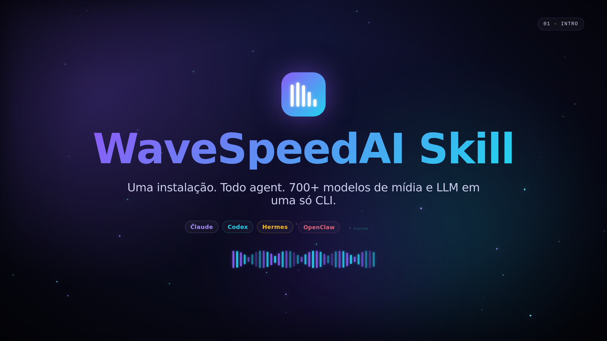

# WaveSpeedAI Skills for Claude, Codex, Hermes, OpenClaw, Others

> 🇺🇸 English. Leia em português: [README.pt-BR.md](README.pt-BR.md).


[](LICENSE)
[](https://agentskills.io)
[](https://wavespeed.ai)
[](CONTRIBUTING.md)

> One install. Every agent. Full WaveSpeedAI inference platform — 700+ media models and 290+ OpenAI-compatible LLMs — wired into Claude Code, Codex, Hermes Agent, OpenClaw, Cursor, Windsurf, and any other host that follows the [agentskills.io](https://agentskills.io) `SKILL.md` spec.

## 60-second tour

<p align="center">
  <a href="docs/media/tutorial.mp4">
    
  </a>
  <br/>
  <em>▶ Click to play · 60 s · 1080p · <a href="docs/media/tutorial.mp4">MP4</a> · <a href="docs/media/tutorial.webm">WebM</a></em>
</p>

<details>
<summary>Inline player (autoplay on GitHub)</summary>

https://github.com/wesleysimplicio/WaveSpeedAI-Skills/raw/main/docs/media/tutorial.mp4

</details>

> Source code for the video lives in [`remotion-tutorial/`](remotion-tutorial/) — pure [Remotion](https://www.remotion.dev/) (TypeScript + React), no external assets. Re-render with `cd remotion-tutorial && npm install && npm run build`.

> Per-scene regression stills: [`docs/media/scenes/`](docs/media/scenes/).

```bash
# One-line install (interactive, picks the agents you have)
bash <(curl -fsSL https://raw.githubusercontent.com/wesleysimplicio/WaveSpeedAI-Skills/main/install.sh)
```

```bash
# Generate something
export WAVESPEED_API_KEY="ws_..."        # https://wavespeed.ai/accesskey
wavespeed-cli run wavespeed-ai/z-image/turbo '{"prompt":"Cat in tuxedo"}'
```

---

## Why this exists

WaveSpeedAI gives you one API key for image, video, audio and LLM inference across 700+ models. Their Python SDK is great. Their docs are great. But every agent host (Claude Code, Codex, Hermes, OpenClaw, …) reads `SKILL.md` files in slightly different directories with slightly different frontmatter conventions, and there's no canonical, well-tested skill bundle that covers all of them.

This repo fixes that:

- **Per-agent SKILL.md files** with the right frontmatter for each host.
- **A language-agnostic CLI** (`wavespeed-cli`) so the skill works the same regardless of which agent invokes it.
- **A one-line installer** that detects which agent directories exist on your machine and only installs where it makes sense.
- **Examples + reference docs** that go deeper than a typical skill — submit/poll patterns, webhook verification, batch jobs, LoRA stacking, serverless workers.

It's MIT-licensed, community-maintained, and not affiliated with WaveSpeedAI.

## Supported hosts

| Host | SKILL path | Frontmatter style |
|---|---|---|
| **Claude Code** | `~/.claude/skills/wavespeed/SKILL.md` | `name`, `description`, `allowed-tools` |
| **Codex** | `~/.codex/skills/wavespeed/SKILL.md` | `name`, `description` |
| **Hermes Agent** | `~/.hermes/skills/creative/wavespeed/SKILL.md` | full yaml (version, author, tags, prerequisites) |
| **OpenClaw** | `~/.openclaw/skills/wavespeed/SKILL.md` | name, description, version, tags |
| **Cursor** | `~/.cursor/skills/wavespeed/SKILL.md` | name, description |
| **Windsurf** | `~/.windsurf/skills/wavespeed/SKILL.md` | name, description |
| **Generic** | `~/.config/agent-skills/wavespeed/SKILL.md` | portable, copy anywhere |

The `agents/<host>/SKILL.md` files in this repo are the canonical sources. The installer copies the right one into the right place.

## What you get

- `wavespeed-cli run` / `submit` / `result` / `cancel` — full prediction lifecycle
- `wavespeed-cli upload` — local file → hosted URL for image-to-X workflows
- `wavespeed-cli models` — live catalog (with `--filter` and `--names-only`)
- `wavespeed-cli balance` — account balance check
- `wavespeed-cli llm` — OpenAI-compatible chat completions, with `--system`, `--json-mode`, `--stream`, `--temperature`, `--max-tokens`, `--raw`
- `wavespeed-cli verify-webhook` — HMAC-SHA256 signature verification helper
- Curated [model catalog](references/models.md) covering Z-Image, FLUX, Seedance, Kling, Veo, Luma, Wan, Qwen, Higgsfield, ace-step, and the LLM list (Anthropic, OpenAI, Google, Meta, DeepSeek, Mistral, Qwen, xAI, Cohere, …)
- Reference docs for [REST](references/rest-api.md), [errors](references/error-codes.md), [rate limits](references/rate-limits.md), and [webhooks](references/webhooks.md)
- Cookbook: [text→image](examples/01-text-to-image.md) · [image→video](examples/02-image-to-video.md) · [text→video w/ audio](examples/03-text-to-video-with-audio.md) · [LLM chat](examples/04-llm-chat.md) · [LoRA](examples/05-lora.md) · [serverless workers](examples/06-serverless-worker.md) · [webhooks](examples/07-webhooks.md) · [batch jobs](examples/08-batch-jobs.md)

## Install

### One-liner (recommended)

```bash
bash <(curl -fsSL https://raw.githubusercontent.com/wesleysimplicio/WaveSpeedAI-Skills/main/install.sh)
```

The installer:

1. Provisions an isolated Python venv at `~/.local/share/wavespeed-skill/venv` (uses `uv` if available, falls back to `python3 -m venv`).
2. Installs the `wavespeed` Python SDK + `requests` into that venv.
3. Drops the `wavespeed-cli` shim into `~/.local/bin/`.
4. Detects which agent directories you already have (`~/.claude`, `~/.codex`, `~/.hermes`, `~/.openclaw`, `~/.cursor`, `~/.windsurf`) and asks before installing each `SKILL.md`.

Flags:

```bash
bash install.sh --yes                       # non-interactive, install everywhere
bash install.sh --agents claude,codex       # install only for these hosts
bash install.sh --uninstall                 # remove venv + CLI + all SKILLs
```

### Clone and install locally

```bash
git clone https://github.com/wesleysimplicio/WaveSpeedAI-Skills.git
cd WaveSpeedAI-Skills
bash install.sh
```

### Manual (one specific agent)

```bash
mkdir -p ~/.claude/skills/wavespeed
cp agents/claude/SKILL.md ~/.claude/skills/wavespeed/SKILL.md
```

…then install the CLI:

```bash
mkdir -p ~/.local/share/wavespeed-skill
cp cli/cli.py ~/.local/share/wavespeed-skill/cli.py
cp cli/wavespeed-cli ~/.local/bin/wavespeed-cli
chmod +x ~/.local/bin/wavespeed-cli
uv venv --python 3.12 ~/.local/share/wavespeed-skill/venv
uv pip install --python ~/.local/share/wavespeed-skill/venv/bin/python wavespeed requests
```

## Configure

```bash
export WAVESPEED_API_KEY="ws_..."     # https://wavespeed.ai/accesskey
```

Optional overrides:

```bash
export WAVESPEED_API_BASE="https://api.wavespeed.ai/api/v3"
export WAVESPEED_LLM_BASE="https://llm.wavespeed.ai/v1"
export WAVESPEED_WEBHOOK_SECRET="ws_secret_..."   # for verify-webhook
```

Persist them in `~/.zshrc` / `~/.bashrc` / `~/.config/fish/config.fish`.

## Usage

### Image

```bash
# Fast (sub-2s)
wavespeed-cli run wavespeed-ai/z-image/turbo '{"prompt":"Cat in tuxedo"}'

# Quality
wavespeed-cli run wavespeed-ai/flux-dev \
  '{"prompt":"Octopus chess game, studio lighting","size":"1024x1024"}'
```

### Video

```bash
URL=$(wavespeed-cli upload ./hero.png)
wavespeed-cli run wavespeed-ai/seedance-v2 \
  "$(jq -nc --arg u "$URL" '{image:$u, prompt:"slow camera dolly in"}')"

wavespeed-cli run wavespeed-ai/veo-3 '{"prompt":"thunderstorm at dusk, cinematic"}'
```

### Async + webhook (recommended for video)

```bash
ID=$(wavespeed-cli submit wavespeed-ai/veo-3 '{"prompt":"..."}' \
       --webhook-url https://your.app/wavespeed/cb \
     | jq -r '.data.id')
wavespeed-cli result "$ID" --wait
```

### LLM

```bash
wavespeed-cli llm anthropic/claude-opus-4.6 "Summarize WaveSpeed in one line."
wavespeed-cli llm openai/gpt-5.2-pro "..." --system "Be terse." --stream
wavespeed-cli llm google/gemini-3-flash-preview '{"city":"Lisbon"}' --json-mode
```

### Python

```python
import wavespeed
out = wavespeed.run("wavespeed-ai/z-image/turbo", {"prompt": "Cat"})
print(out["outputs"][0])
```

Run scripts against the dedicated venv:

```bash
~/.local/share/wavespeed-skill/venv/bin/python myscript.py
```

Or ad-hoc:

```bash
uv run --with wavespeed python myscript.py
```

## Repo layout

```
WaveSpeedAI-Skills/
├── README.md                     # this file
├── LICENSE                       # MIT
├── CHANGELOG.md
├── CONTRIBUTING.md
├── CODE_OF_CONDUCT.md
├── install.sh                    # one-line installer
├── agents/                       # per-host SKILL.md (the source of truth)
│   ├── claude/SKILL.md
│   ├── codex/SKILL.md
│   ├── hermes/SKILL.md
│   ├── openclaw/SKILL.md
│   ├── cursor/SKILL.md
│   ├── windsurf/SKILL.md
│   └── generic/SKILL.md
├── cli/
│   ├── cli.py                    # full Python CLI
│   └── wavespeed-cli             # bash shim
├── examples/                     # cookbook
│   ├── 01-text-to-image.md
│   ├── 02-image-to-video.md
│   ├── 03-text-to-video-with-audio.md
│   ├── 04-llm-chat.md
│   ├── 05-lora.md
│   ├── 06-serverless-worker.md
│   ├── 07-webhooks.md
│   └── 08-batch-jobs.md
├── references/                   # protocol-level docs
│   ├── models.md
│   ├── rest-api.md
│   ├── error-codes.md
│   ├── rate-limits.md
│   └── webhooks.md
├── scripts/                      # repo housekeeping
└── .github/                      # CI, issue/PR templates
```

## Comparison

| | This repo | `al1enjesus/wavespeed` (OpenClaw mirror) | DIY ad-hoc skill |
|---|---|---|---|
| Targets multiple hosts | yes (7) | OpenClaw only | usually one |
| Python SDK + CLI | both | Node-only | varies |
| LLM gateway covered | yes | partial | rare |
| Serverless workers | yes | no | no |
| Webhook signature helper | yes | no | no |
| Curated model catalog | yes | partial | no |
| MIT, public, opinionated install | yes | yes | varies |

## Verifying everything works

```bash
wavespeed-cli --version
wavespeed-cli models --names-only | head
wavespeed-cli balance
wavespeed-cli run wavespeed-ai/z-image/turbo '{"prompt":"hello world"}'
```

If any step prints an error, see the [troubleshooting section](#troubleshooting) below.

## Troubleshooting

- **`WAVESPEED_API_KEY not set`** — export it; key from https://wavespeed.ai/accesskey.
- **`wavespeed-cli: command not found`** — make sure `~/.local/bin` is in your `$PATH`. The installer warns when it isn't.
- **`401 Unauthorized`** — key revoked or wrong account; re-issue.
- **`402 insufficient balance`** — check `wavespeed-cli balance`; some models are tier-locked. See [rate-limits.md](references/rate-limits.md).
- **`429 rate-limited`** — back off; respect `Retry-After`. See [batch-jobs.md](examples/08-batch-jobs.md) for the throttling pattern.
- **Hangs forever** — model is stuck, or the default 36000s timeout is too high. Cancel with `wavespeed-cli cancel <id>` and resubmit with `--timeout 600`.
- **Webhook signature invalid** — you parsed the body before hashing; hash the raw bytes. See [webhooks.md](references/webhooks.md).
- **Docs page returns 500** — wavespeed.ai/docs occasionally hiccups. Use the GitHub READMEs as backup (`WaveSpeedAI/wavespeed-python`, `WaveSpeedAI/wavespeed-javascript`).

## Contributing

PRs welcome. See [CONTRIBUTING.md](CONTRIBUTING.md). Please be kind — see [CODE_OF_CONDUCT.md](CODE_OF_CONDUCT.md).

Things that would help:

- Add a SKILL.md for an agent host that isn't covered yet (Aider, Kilo Code, OpenCode, Gemini CLI, others on [agentskills.io](https://agentskills.io)).
- Update the curated model list as WaveSpeed ships new families.
- Add a cookbook entry for a model family that's missing one (e.g. lipsync, 3D, audio music).
- Translate the README to other languages (PT-BR, ES, ZH).

## Acknowledgments

- [WaveSpeedAI](https://wavespeed.ai) for building the platform and the SDKs.
- The [agentskills.io](https://agentskills.io) community for the SKILL.md spec.
- `al1enjesus/wavespeed` (OpenClaw marketplace) — earlier community skill that proved demand for this.

## License

MIT — see [LICENSE](LICENSE). Not affiliated with WaveSpeedAI Inc. Trademarks belong to their respective owners.

## Links

- [WaveSpeedAI](https://wavespeed.ai) · [Docs](https://wavespeed.ai/docs) · [Models](https://wavespeed.ai/models) · [Get an API key](https://wavespeed.ai/accesskey) · [Discord](https://discord.gg/wavespeed)
- [Python SDK](https://github.com/WaveSpeedAI/wavespeed-python) · [JavaScript SDK](https://github.com/WaveSpeedAI/wavespeed-javascript) · [ComfyUI](https://github.com/WaveSpeedAI/wavespeed-comfyui) · [n8n](https://github.com/WaveSpeedAI/wavespeed-n8n)
- [Skill spec](https://agentskills.io)
